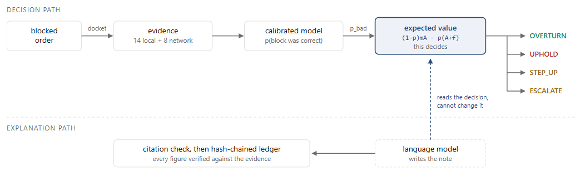

# Reclaimify

**Razorpay Buildathon 2026, Track 02.**

<a href="https://bhavit069.github.io/Razorpay-Buildathon-Project/" target="_blank">
  
</a>

A merchant's fraud system blocks an order. Nothing ever looks at that decision
again. This reviews the blocked pile and decides which blocks were wrong.

---

## The problem

Someone tries to buy something and the shop's fraud software blocks it. They
are not a fraudster. They bought a phone last week so the device is new, or
they are sending a gift so the address does not match billing, or they shop at
1am, or they live in Patna rather than Bengaluru.

What happens next is nothing. The customer assumes their bank declined them and
buys elsewhere. No complaint, no dispute, no refund, no row in any ledger
saying a good customer was refused.

Fraud is not like that. A chargeback arrives, money is clawed back, there is a
fee and a record, and someone's number moves. **One side of the trade is
measured and the other is not**, so blocking more always looks like an
improvement. About a third of merchants do not track their false-decline rate,
which is less negligence than an absence of anything to track.

## What it does



The arithmetic decides. **The language model explains and negotiates; it never
decides whether money moves.** Three tests enforce that: the tools it can reach
take no free text, the extraction schema has no field for a decision, and
verdicts are handed a decision that was already made.

Release and uphold are the easy two. The other two matter more. *Ask a
question* means there is not enough evidence but enough money to be worth a
short verification exchange, which generates new evidence instead of re-arguing
the old. *Send to a human* means no question would settle it. At the shipped
settings the system refuses to decide on **15.3%** of cases, because a system
that always answers is claiming to know things it does not.

## Why a payment platform

A merchant scoring a first-time order sees one thing: this person, at this
shop, never seen before. Thin file, high risk. That inference is correct given
what it can see. A platform sees the same identity across every merchant on the
rails — eight hundred orders, three years, forty merchants, one device. A
single merchant cannot buy that.

The obvious rule loses, though. "Long clean history means safe" is what
professional abuse is built to beat: 42% of fraudsters here farm a record
first. So the test is not whether the system releases obviously good customers.
It is whether it refuses someone whose record looks perfect — and there is a
case in the data with a 1.000 clean rate that it blocks, because two orders
across seven merchants in 33 days is reconnaissance, not shopping.

## The numbers

1,775 blocked orders the model never trained on, at the operating point that
ships:

| | |
|---|---|
| Good orders rescued | **88.2%** of recoverable |
| Released, and good | 96.3% |
| Revenue recovered | **Rs 7.21 cr** |
| Fraud let through | **Rs 51.21 L** |
| Net contribution | Rs 1.29 cr |
| Refused to decide | 15.3% |

Cap 0.20, and it is not tuned: it sits where the expected value of releasing
stops being positive at a 25% margin. Tuning down to 0.02 would show 98.6%
precision instead — the threshold that flatters the table, which is the
behaviour this project exists to criticise.

**Recovery and fraud admitted appear together on every table here.** Releasing
*every* blocked order recovers the most gross revenue of any strategy and still
loses money, because you earn margin on the good ones and lose the whole basket
on the bad ones. A recovery figure quoted alone means nothing.

### Four things that make it look worse

- **A human reviewer wins on judgment.** A person adjudicating every case at
  87.5% accuracy reaches Rs 1.36 cr against our Rs 1.29 cr. What they cannot do
  is reach the pile: at Rs 150 and four hours a case, real queues are worked
  down by value until the day runs out. A reviewer covering the top 10%
  recovers 8.6% of recoverable revenue against 88.2% here. **The gap is reach,
  not intelligence.**
- **The rupee figures move.** Across five generated worlds, regraded at the same
  operating point, net contribution runs Rs 0.90 cr to Rs 1.86 cr and precision
  92.0% to 98.2%. Recall is steadiest at 83.1% to 89.6%. Quote the range. An
  earlier draft called precision stable at 97.8–99.1%; that sweep re-picked the
  threshold per seed, absorbing the variation it was measuring.
- **The cross-merchant advantage is modest**, about +4.6% in profit terms and
  +0.043 to +0.072 AUC. Our own earlier documents claimed more and were wrong.
  What survives is shape, not size: network evidence releases more orders *at
  higher accuracy simultaneously*, which moving a threshold cannot do.
- **Pricing does not transfer.** Drop the largest merchant from training and
  score only them: AUC falls 0.0008, but precision falls 92.9% → 89.0%. The
  expensive part comes free; calibrating to one merchant's baskets needs a few
  hundred of their own cases.

## Running it

```bash
pip install -r requirements.txt
python run.py data300k    # build the simulated world      ~31s, writes 95 MB
python run.py metrics     # regenerate every number        ~60s
python run.py test        # 118 tests                      ~15s
python run.py room        # build demo/case_room.html
python run.py console     # build demo/console.html
python run.py serve       # both on http://localhost:4000
python run.py dry         # 17 checks, with the network cut
```

`data300k` has to run first; it is not committed because it reproduces exactly
from the seed. `dry` wants the case room built, so run `room` before it.
Everything else is order-independent.

Also available: `agent` (run the agent over the blocked pile), `docs`
(regenerate the generated blocks), `recovery`, `seeds` (~6 min), `warm`
(record new model replies, needs a key), `validate`, `moat`, `sweep`, `clean`.

### The console

One page, five sections, on the number keys **1**–**5**:

| | |
|---|---|
| **01 How it works** | the pipeline, end to end |
| **02 Portfolio & signals** | what is in the pile, and what we read |
| **03 Run the agent** | adjudicate one order and watch it decided |
| **04 Operating point** | the trade curve, on a live slider |
| **05 How honest is it** | the numbers that got worse |

On **03**, pick a case or edit any field, as a labelled control or as raw JSON.
Back comes the verdict and then how it got there in eight steps: the fields it
read, three of the 300 trees walked in full with the branch taken at every
split, what one field at a time would have done to the score, the isotonic
bracket, the evidence gate, the expected-value line, and the four-rung policy
ladder with the rung that fired marked.

That page evaluates the fitted trees **in the browser**, and the build refuses
to write it unless the JavaScript reproduces the Python probability on all
1,775 holdout cases. On **04**, dragging the cap moves the curve markers, the
deployment panel and the reviewer chart in 05 with it.

## Layout

| Path | What is in it |
|---|---|
| `demo/` | Open `console.html` with nothing installed. `flow.html` walks one case through the pipeline. |
| `docs/` | `DOCUMENTATION.md`, everything the project claims, and five notebooks |
| `core/` | The decision core: features, model, policy, backtest, metrics, recovery ladder |
| `agent/` | The language-model layer: orchestrator, tools, verdicts, step-up, ledger |
| `web/` | Page sources, and the four scripts that verify them against Python |
| `simulation/` | The world generator, and the checks that say the signal is real |
| `tests/` | 118 tests. `test_leakage.py` is the one that matters most. |
| `tools/` | Scripts you run rather than import: the dry run, the seed sweep |
| `artifacts/` | Generated data. No HTML. |

**`docs/DOCUMENTATION.md` is the long version** — the problem, the
architecture, the data card, every measured number, the recovery ladder, and a
log of every bug found on the way. Its measured sections regenerate from the
code.

## Caveats

- **The data is synthetic.** We wrote the world, so we wrote the answers.
  Calibrating against published figures and sweeping the parameters reduces the
  circularity without removing it. The claim is that the conclusions survive
  the assumptions we chose, not that this is what reality looks like.
- **The test set is small** at 1,775 cases and the intervals are wide. They are
  published rather than omitted, and they cover sampling error inside one
  generated world, which is narrower than the variation between worlds.
- **77% of the holdout's value sits with one merchant**, so the rupee headline
  is substantially a measurement of that merchant's blocked pile.
- **Cross-merchant data has real privacy implications.** The features are
  aggregate behavioural counts rather than shared personal information, and a
  processor already holds this data. That is an argument, not a dismissal.
- **This does not replace a fraud system.** It reviews one, the way an appeals
  court re-examines a decision with more evidence and a different standard.

---

<p align="center">
  
</p>

<p align="center">
  Built by <b>Bhavit Rao</b> for Razorpay's Buildathon 2026 &middot; Track 02
</p>
