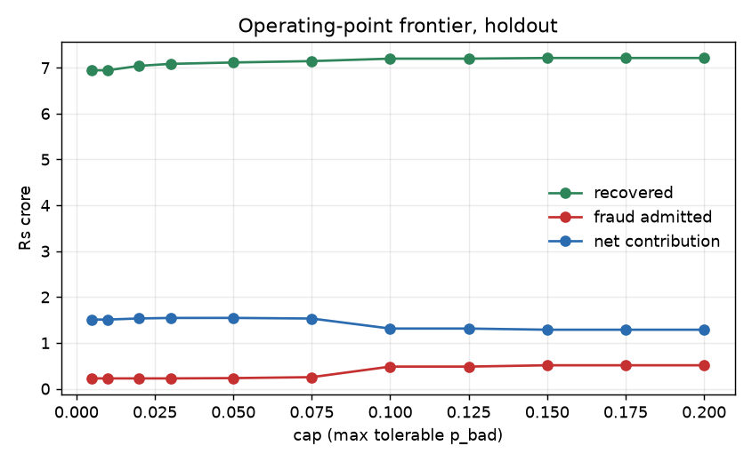
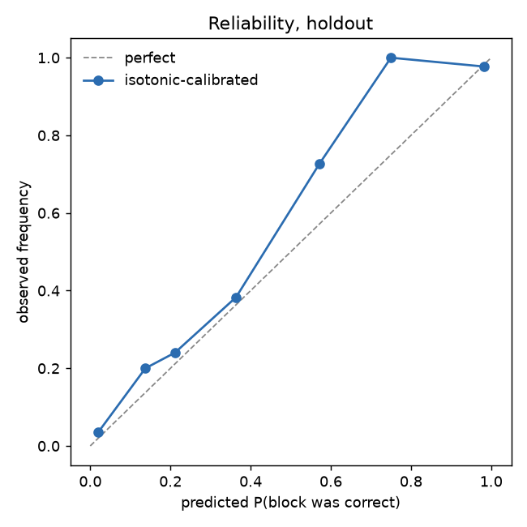
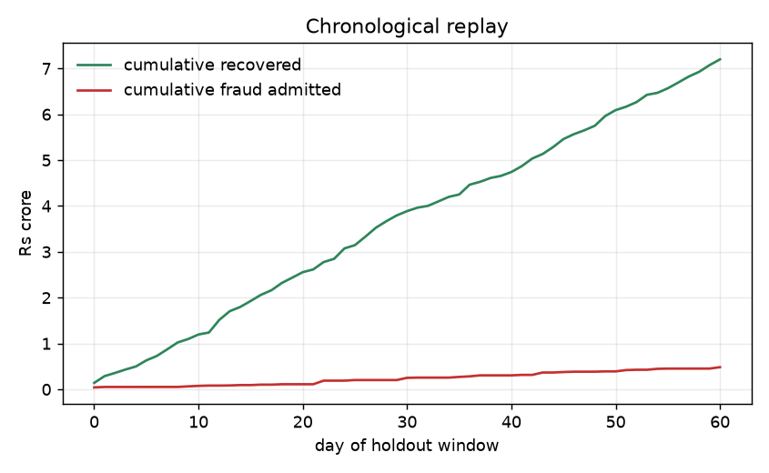

# METRICS

Generated 2026-08-30 12:47 UTC by `python run.py metrics`. Regenerates from seed. No number here is typed by hand.

- Dataset `data300k/` - 8265 appealed (blocked) orders, 6490 train / 1775 holdout, temporal split.
- Learner `lightgbm`, isotonic-calibrated on the last 1298 train cases; fitted on 5192.
- No parameter, threshold or operating point was chosen on holdout. They were chosen on the calibration slice. Holdout is read many times below, but only to report -- never to decide.
- Confidence intervals: percentile bootstrap over 1400 customers (not 1775 cases -- 36% of cases share a customer and are not independent), B=2000.
- These intervals cover sampling error **within one generated world**. They do not cover the variation between worlds, which is larger. See 8.

## 1. Headline, holdout

Policy at cap=0.2, margin=0.25, overhead=Rs 750 per bad release.

Two declared assumptions, neither of which the data can supply:

- **Deployment: inline at checkout, full order value.** This decides whether a release is worth anything. Running inline at checkout books the full order value because the customer is still in session; a queue review has to discount for the ones who never come back. Inline also requires the step-up exchange to finish in session. Section 11 reports the queue case.
- **Step-up pass rates: good=0.90/bad=0.08.** Swept in section 5.

| Metric | Value | 95% CI |
|---|---|---|
| **Recall of recoverable** | **88.2%** | [86.5%, 89.9%] |
| Overturn precision | 96.3% | [95.3%, 97.3%] |
| Revenue recovered | Rs 7.21 cr | [Rs 6.49 cr, Rs 7.95 cr] |
| **Fraud admitted** | **Rs 51.21 L** | [Rs 30.55 L, Rs 75.61 L] |
| Net (gross convention) | Rs 6.70 cr | [Rs 5.90 cr, Rs 7.45 cr] |
| Net contribution | Rs 1.29 cr | [Rs 97.37 L, Rs 1.57 cr] |
| **Abstention rate** | **15.3%** | [13.6%, 17.0%] |
| Escalation rate | 0.5% | - |
| Cases left undecided | 272 of 1775 | - |

Decision mix: OVERTURN 1133, UPHOLD 370, STEP_UP 263, ESCALATE 9. 181 of 263 step-ups passed verification under the stated assumption and were released.

Recall leads the table on purpose. This system exists to get wrongly blocked customers through, so the share of recoverable revenue it actually recovers is the metric that matters; precision is the constraint, not the goal. At this operating point it recovers 88.2% of recoverable revenue and leaves 15.3% of cases undecided.

Two rupee columns. Net (gross convention) is recovered minus admitted, how the industry and `IDEA.md` quote it. Net contribution is what reaches the P&L: margin on a recovered sale, the entire basket on a bad one. The second is smaller, and is what the policy optimises.

**Every rupee figure on this page is one draw of a generated world.** Rerunning the whole pipeline on 5 independently generated datasets, all graded at this same cap=0.2, net contribution runs Rs 89.95 L to Rs 1.86 cr and fraud admitted Rs 8.13 L to Rs 51.21 L. That is wider than the bootstrap interval above, so quote the range and not the point. Precision moves almost as much, 92.0% to 98.2%; recall is the steadiest of the three at 83.1% to 89.6%. Section 8 has the sweep.

## 2. Baselines

| Policy | cap | Released | Precision | Recovered | Fraud admitted | Net | Net contribution |
|---|---|---|---|---|---|---|---|
| Do nothing (status quo) | - | 0 | n/a | Rs 0 | Rs 0 | Rs 0 | Rs 0 |
| Release everything | - | 1775 | 80.8% | Rs 7.43 cr | Rs 1.92 cr | Rs 5.51 cr | -Rs 8.79 L |
| Human reviewer at 87.5%, reviews all 1775 | - | 1311 | 96.6% | Rs 6.51 cr | Rs 23.77 L | Rs 6.24 cr | Rs 1.36 cr |
| Human reviewer, top 3% by value | - | 37 | 94.6% | Rs 1.39 cr | Rs 6.41 L | Rs 1.32 cr | Rs 28.17 L |
| Human reviewer, top 10% by value | - | 130 | 95.4% | Rs 3.36 cr | Rs 14.23 L | Rs 3.21 cr | Rs 69.41 L |
| Merchant-local model only | 0.005 | 993 | 98.3% | Rs 6.68 cr | Rs 20.18 L | Rs 6.47 cr | Rs 1.47 cr |
| Network evidence only | 0.050 | 802 | 98.1% | Rs 6.54 cr | Rs 20.67 L | Rs 6.34 cr | Rs 1.43 cr |
| Local + network, cap tuned off-holdout | 0.020 | 1181 | 98.6% | Rs 7.04 cr | Rs 22.57 L | Rs 6.82 cr | Rs 1.53 cr |
| **Local + network at the EV point (shipped)** | 0.2 | 1314 | 96.3% | Rs 7.21 cr | Rs 51.21 L | Rs 6.70 cr | Rs 1.29 cr |

Two rows for this system, and the shipped one is the worse-looking of the two. The tuned row exists only to make the ablation fair: comparing models at one arbitrary cap measures the cap. The shipped row is the operating point actually used, cap=0.2, which is where EV(release) stops being positive. Tuning down to 0.020 buys 98.6% precision instead of 96.3%, and costs 7.1% of recall. Picking the threshold that flatters the precision column is the behaviour this project criticises, so the headline uses the EV point.

Release-everything recovers the most gross revenue and still loses money: -Rs 8.79 L of net contribution, because margin on the good orders does not cover the full baskets lost on the bad ones.

**The human reviewer is the baseline that matters, and this system does not beat it on judgment.** A person adjudicating every case at 87.5% accuracy reaches Rs 1.36 cr against Rs 1.29 cr at the shipped operating point, after paying Rs 2.66 L in review time. On accuracy alone a competent reviewer wins, and that row is left in the table because it is true.

What does not survive is that row's assumption: that a person reviews all 1775 cases. Manual review costs Rs 150 and takes around 4 hours per case. Real queues are ranked by order value and worked down until the day runs out. The two rationed rows are the same reviewer at the same 87.5% accuracy, reaching only the top slice; everything below the line stays blocked and recovers nothing, because nobody undid the block.

| Reviewer coverage | Cases reviewed | Recall of recoverable | Net contribution |
|---|---|---|---|
| all 1775 | 1775 | 88.3% | Rs 1.36 cr |
| top 3% by value | 53 | 2.4% | Rs 28.17 L |
| top 10% by value | 178 | 8.6% | Rs 69.41 L |
| **this system, all 1775** | **1775** | **88.2%** | **Rs 1.29 cr** |

Those rows together are the actual claim. A reviewer beats this system case for case. Nobody can afford to run one across the whole pile, so in practice most cases are never reviewed at all: at 10% coverage a reviewer recovers 8.6% of recoverable revenue against 88.2% here, and Rs 69.41 L of contribution against Rs 1.29 cr. The gap is not judgment. It is coverage. This runs at effectively zero marginal cost and a p50 under a millisecond, so it reaches the 1597 cases the queue never gets to, which are exactly the small ones where the customer is least likely to complain and most likely to leave quietly.

Network evidence is worth **Rs 6.76 L** of net contribution over the merchant-local model (+4.6%) on 1775 holdout cases. It releases 188 more orders *at higher precision* (98.6% vs 98.3%) -- more revenue and less fraud at the same time, which a pure threshold move cannot do.

Comparing the two models at a shared raw-probability threshold on uncalibrated scores shows a much larger gap. Most of that gap is miscalibration in the local model rather than missing evidence: isotonic calibration removes it, and the EV policy then picks a workable operating point for either model. With both calibrated and each tuned off-holdout the difference is +4.6% of net contribution and +0.045 AUC.

## 3. The operating-point frontier

| cap | Released | Precision | Recall | Recovered | Fraud admitted | Net | Net contribution |
|---|---|---|---|---|---|---|---|
| 0.005 | 1124 | 98.5% | 77.1% | Rs 6.95 cr | Rs 22.57 L | Rs 6.72 cr | Rs 1.51 cr |
| 0.010 | 1124 | 98.5% | 77.1% | Rs 6.95 cr | Rs 22.57 L | Rs 6.72 cr | Rs 1.51 cr |
| 0.020 | 1181 | 98.6% | 81.1% | Rs 7.04 cr | Rs 22.57 L | Rs 6.82 cr | Rs 1.53 cr |
| 0.030 | 1196 | 98.6% | 82.2% | Rs 7.08 cr | Rs 22.57 L | Rs 6.86 cr | Rs 1.54 cr |
| 0.050 | 1213 | 98.4% | 83.2% | Rs 7.11 cr | Rs 23.23 L | Rs 6.88 cr | Rs 1.54 cr |
| 0.075 | 1245 | 98.2% | 85.2% | Rs 7.14 cr | Rs 25.30 L | Rs 6.89 cr | Rs 1.53 cr |
| 0.100 | 1303 | 96.7% | 87.8% | Rs 7.20 cr | Rs 48.33 L | Rs 6.71 cr | Rs 1.31 cr |
| 0.125 | 1303 | 96.7% | 87.8% | Rs 7.20 cr | Rs 48.33 L | Rs 6.71 cr | Rs 1.31 cr |
| 0.150 | 1314 | 96.3% | 88.2% | Rs 7.21 cr | Rs 51.21 L | Rs 6.70 cr | Rs 1.29 cr |
| 0.175 | 1314 | 96.3% | 88.2% | Rs 7.21 cr | Rs 51.21 L | Rs 6.70 cr | Rs 1.29 cr |
| 0.200 | 1314 | 96.3% | 88.2% | Rs 7.21 cr | Rs 51.21 L | Rs 6.70 cr | Rs 1.29 cr |

**The cap saturates at 0.20 and cannot be pushed past it.** EV(release) > 0 requires `(1-p)mA > p(A+f)`, i.e. `p < m/(1+m)`; at the default margin m=0.25 that is 0.20, independent of order size. Contribution margin, not risk appetite, sets the ceiling on how much doubt a release can carry. This is a real difference from the sweep in `IDEA.md` 7, which sweeps a raw probability threshold to 0.50 -- values an EV policy can never reach.

### Per-merchant operating points

Chosen on the calibration slice by maximising net contribution, then applied unchanged to holdout.

| Merchant | cap | Released | Precision | Net contribution |
|---|---|---|---|---|
| Aurum Jewels | 0.020 | 351 | 97.4% | Rs 1.25 cr |
| BookNest | 0.100 | 15 | 100.0% | Rs 7,672 |
| HomeHaul | 0.075 | 253 | 98.4% | Rs 19.04 L |
| Kirana Direct | 0.100 | 137 | 98.5% | Rs 1.11 L |
| PharmaNow | 0.100 | 133 | 99.2% | Rs 91,047 |
| SnackBox | 0.100 | 106 | 98.1% | Rs 44,634 |
| Threadline | 0.075 | 166 | 98.2% | Rs 3.44 L |
| Voltcart | 0.005 | 100 | 98.0% | Rs 12.50 L |
| **All, per-merchant caps** | - | 1261 | 98.2% | **Rs 1.54 cr** |
| All, single global cap=0.2 | 0.2 | 1314 | 96.3% | Rs 1.29 cr |

Per-merchant caps add Rs 24.83 L over one global cap (+19%), by releasing fewer orders at higher precision.

## 4. Ablations and calibration

| Evidence blocks | AUC | AP | Brier | Net contribution |
|---|---|---|---|---|
| local + network | 0.9134 | 0.7633 | 0.0781 | Rs 1.29 cr |
| local | 0.8682 | 0.6189 | 0.1026 | Rs 1.33 cr |
| network | 0.7768 | 0.6498 | 0.0926 | Rs 84.42 L |

AUC lift from network evidence: +0.0452. AP lift: +0.1444. AUC averages rank quality over every threshold, while releases happen only in the low-p_bad tail, so it is not the quantity that decides anything here. Use the contribution column.

| predicted | observed | n |
|---|---|---|
| 0.020 | 0.036 | 1125 |
| 0.138 | 0.200 | 30 |
| 0.211 | 0.240 | 333 |
| 0.364 | 0.383 | 94 |
| 0.572 | 0.727 | 44 |
| 0.750 | 1.000 | 15 |
| 0.982 | 0.977 | 132 |

### Feature importances

| feature | gain | split count |
|---|---|---|
| `network_clean_rate` | 0.3455 | 0.0853 |
| `network_merchants_prior` | 0.1857 | 0.0617 |
| `f_is_cod` | 0.1207 | 0.0334 |
| `network_tenure_days` | 0.0532 | 0.1381 |
| `network_orders_prior` | 0.0521 | 0.0931 |
| `amount` | 0.0362 | 0.1145 |
| `risk_score` | 0.0360 | 0.1187 |
| `f_orders_last_24h` | 0.0338 | 0.0193 |
| `f_amount_z` | 0.0337 | 0.1162 |
| `network_rto_prior` | 0.0229 | 0.0404 |

`DATA_CARD.md` 6.4 warns that `network_clean_rate` dominates importance (~0.49 there) and that this is partly real signal, partly residual construction. Under this model it carries **0.346 of gain at rank 1** -- the warning is **confirmed**. Treat conclusions that lean on that one feature with suspicion.

The two columns disagree. Split count is how often a feature was used, is nearly flat by construction, and puts `network_clean_rate` at 0.085, sixth. Gain is how much each split improved the objective and puts the same feature first at 0.346. LightGBM reports split count by default, so the default would have understated the concentration. Use the ablation table rather than either column.

## 5. Sensitivity

### Step-up assumption grid

The dataset cannot say whether a customer would pass verification, so it is a declared parameter and swept.

| p(pass\|good) | p(pass\|bad) | Released | Precision | Net contribution |
|---|---|---|---|---|
| 0.85 | 0.03 | 1299 | 96.5% | Rs 1.29 cr |
| 0.85 | 0.08 | 1302 | 96.3% | Rs 1.25 cr |
| 0.85 | 0.15 | 1307 | 95.9% | Rs 1.24 cr |
| 0.90 | 0.03 | 1311 | 96.6% | Rs 1.33 cr |
| 0.90 | 0.08 | 1314 | 96.3% | Rs 1.29 cr |
| 0.90 | 0.15 | 1319 | 96.0% | Rs 1.27 cr |
| 0.95 | 0.03 | 1313 | 96.6% | Rs 1.33 cr |
| 0.95 | 0.08 | 1316 | 96.4% | Rs 1.29 cr |
| 0.95 | 0.15 | 1321 | 96.0% | Rs 1.28 cr |

### Economic parameters

| margin m | EV ceiling m/(1+m) | Released | Precision | Net contribution |
|---|---|---|---|---|
| 0.15 | 0.130 | 1290 | 96.7% | Rs 59.31 L |
| 0.25 | 0.200 | 1314 | 96.3% | Rs 1.29 cr |
| 0.40 | 0.286 | 1319 | 96.2% | Rs 2.37 cr |

| overhead f per bad release | Released | Precision | Net contribution |
|---|---|---|---|
| Rs 250 | 1319 | 96.2% | Rs 1.29 cr |
| Rs 750 | 1314 | 96.3% | Rs 1.29 cr |
| Rs 1,500 | 1307 | 96.3% | Rs 1.28 cr |

Block-rate sensitivity (regenerating the world at four scorecard intercepts) is a data-generation sweep rather than a policy sweep: `python run.py sweep`.

## 6. The failure exhibit

The five costliest wrong releases at the headline operating point.

| payment_id | Merchant | Amount | p_bad | How released | Block reason | Network file |
|---|---|---|---|---|---|---|
| `pay_uVSI51jHI2v7T4` | Aurum Jewels | Rs 5.14 L | 0.098 | direct overturn | amount_anomaly | 5 orders / 1 merchants / 359d / clean 1.00 / 0 disputes |
| `pay_PUyUECOg4UTiTE` | Aurum Jewels | Rs 4.19 L | 0.098 | direct overturn | amount_anomaly | 19 orders / 3 merchants / 1443d / clean 0.95 / 0 disputes |
| `pay_N2qffKv4UTooIi` | Aurum Jewels | Rs 4.03 L | 0.098 | direct overturn | address_mismatch | 5 orders / 2 merchants / 395d / clean 1.00 / 0 disputes |
| `pay_xKq663PUe3u0Co` | Aurum Jewels | Rs 3.84 L | 0.204 | **passed step-up** | instrument_risk | 73 orders / 3 merchants / 1215d / clean 1.00 / 0 disputes |
| `pay_5KVTMvf8syNwYA` | Aurum Jewels | Rs 3.80 L | 0.098 | direct overturn | amount_anomaly | 9 orders / 2 merchants / 342d / clean 0.44 / 3 disputes |

Total cost of these five: Rs 20.99 L, against Rs 7.21 cr recovered.

Most of these network files are long, clean and real. This is first-party misuse: friendly fraud from customers with genuine histories, where the evidence that exonerates an honest atypical buyer is the same evidence. No threshold removes this class of error; the operating point prices it. One row breaks the pattern, carrying disputes and a poor clean rate, which the model should have caught.

1 of the five was released by passing a simulated verification exchange rather than by the policy; its `p_bad` sits above the cap. That is the step-up assumption (good=0.90/bad=0.08) costing money, and why 5 reports a grid.

## 7. Chronological replay

Best single day in the holdout window: day 12, Rs 27.63 L recovered against Rs 0 admitted.

## 8. Variation between generated worlds

The pipeline was rerun end to end on 5 independently generated datasets: same config, different seed.

Each seed is graded twice. The **shipped** columns use cap 0.2, the operating point every number on this page is priced at, and those are the figures the headline quotes. The **tuned** column re-picks the cap on that seed's own calibration slice and exists only to keep the ablation fair. Quoting a range measured at the tuned point beside a headline priced at the shipped point compares two different policies, which is what an earlier draft of this section did.

| seed | holdout | local AUC | +network AUC | lift | shipped precision | shipped recall | shipped fraud admitted | shipped contribution | tuned contribution |
|---|---|---|---|---|---|---|---|---|---|
| 42 | 1775 | 0.8682 | 0.9134 | +0.0452 | 96.3% | 88.2% | Rs 51.21 L | Rs 1.29 cr | Rs 1.53 cr |
| 1 | 1745 | 0.8501 | 0.9209 | +0.0709 | 97.6% | 89.3% | Rs 16.63 L | Rs 1.86 cr | Rs 1.87 cr |
| 2 | 1486 | 0.8414 | 0.9066 | +0.0651 | 92.0% | 89.6% | Rs 41.43 L | Rs 89.95 L | Rs 1.15 cr |
| 3 | 1826 | 0.8602 | 0.9321 | +0.0719 | 95.6% | 87.0% | Rs 38.30 L | Rs 1.51 cr | Rs 1.80 cr |
| 4 | 1800 | 0.8678 | 0.9109 | +0.0431 | 98.2% | 83.1% | Rs 8.13 L | Rs 1.18 cr | Rs 1.19 cr |

At the shipped cap net contribution ranges Rs 89.95 L to Rs 1.86 cr, sd Rs 32.37 L. That range is wider than the bootstrap interval in 1, so the rupee figures are limited by how the world was generated, not by how many cases the holdout holds. Quote a range, not a point.

Fraud admitted ranges Rs 8.13 L to Rs 51.21 L over the same seeds, so the cost side moves too and is quoted as a range for the same reason.

AUC lift ranges +0.0431 to +0.0719, mean +0.0592.

Seed 42 is the one used everywhere else on this page. Of the 5 seeds, 2 produce less contribution, so it is a middling draw on revenue, and it is the worst of the set on cost: no other seed admits more fraud. It was not chosen for either property; it is the seed the generator shipped with.

**Precision is not the stable quantity it looked like.** At the shipped cap it runs 92.0% to 98.2% across the same five worlds, a spread of 6.2 points, while recall holds tighter at 83.1% to 89.6%. Earlier drafts of this section quoted 97.8% to 99.1% and called precision stable. That range was measured at the per-seed tuned cap, which re-picks the threshold on each world and therefore absorbs exactly the variation being measured. At a fixed operating point the variation shows up, and it is the fixed operating point that ships.

## 9. Demo cases

Selected by predicate, not by payment id. `IDEA.md` 5 names six ids, but those are tied to one seed and five of the six sit in the train split, so showing them means demoing on rows the model was fitted on. Each row is the strongest holdout case matching a role, so the list survives a reseed.

| Role | payment_id | Merchant | Amount | p_bad | True outcome |
|---|---|---|---|---|---|
| A long clean file released for a large amount | `pay_5E72cODtQrmZkn` | Aurum Jewels | Rs 5.16 L | 0.003 | clean |
| A spotless record the system still refuses | `pay_0T6ICR8cppsGGD` | PharmaNow | Rs 1,195 | 0.750 | rto_return |
| An easy refusal | `pay_pB3gMaABohjGbB` | Aurum Jewels | Rs 4.61 L | 0.962 | fraud_undisputed |
| Too thin to judge | `pay_5sr9UbuKWw8GCM` | Aurum Jewels | Rs 2.93 L | 0.204 | chargeback_friendly |
| The most expensive wrong release | `pay_cHqPoyD6hCHji7` | Aurum Jewels | Rs 2.12 L | 0.098 | rto_return |
| Refused partly for where they live | `pay_YUcHCf0wIe45Yo` | HomeHaul | Rs 21,711 | 0.003 | clean |

## 10. A merchant the model never trained on

Aurum Jewels is 451 of 1775 holdout cases and the largest share of holdout value, so most of the rupee figures above are a measurement of one merchant. This is a platform product, so the model has to work on a merchant it has never seen. Dropping 1946 of its training cases and scoring only Aurum Jewels:

| Trained on | AUC | AP | Released | Precision | Recall | Net contribution |
|---|---|---|---|---|---|---|
| everything | 0.8832 | 0.6907 | 379 | 92.9% | 97.5% | Rs 99.71 L |
| everything except Aurum Jewels | 0.8824 | 0.6751 | 401 | 89.0% | 98.9% | Rs 68.69 L |

**Ranking transfers, pricing does not.** Dropping Aurum Jewels from training costs 0.0008 AUC. Precision falls from 92.9% to 89.0% at the same cap, and net contribution by Rs 31.02 L.

The expensive part, learning what fraud looks like across merchants, transfers for free: the model orders an unseen merchant's cases about as well as one it trained on. The cheap part, calibrating to one merchant's baskets and margins, needs a few hundred of their own cases before the operating point can be trusted. That is the shape of a platform product, and the precision drop is the part that makes it credible rather than a slogan.

## 11. Deployment mode

Everything above assumes the review runs inline at checkout, where a released order converts at full value because the customer is still there. As a queue review they have already gone elsewhere and only some return when invited.

**Declared assumption, not a measurement.** Only good releases are discounted. A fraudster invited back to finish a stolen-instrument order is more motivated to return than an honest customer who has already bought elsewhere, so fraud admitted is booked in full at every rate below. Nothing in the data supports that number; it is asserted, and it is asserted in the pessimistic direction. If both returned at the same rate these figures would be better than shown.

### Breakeven is a 28.6% return rate

That is the number to quote, and it is the only one here that does not depend on guessing a parameter. Above a 28.6% customer return rate the programme makes money as a queue review; below it, it costs money to run. A rate is a guess, a threshold is a claim that can be checked against whatever rate a pilot actually measures.

The band is reported underneath because an in-session retry prompt is close to inline and a next-day email is not, and no single point in that range is defensible on its own.

| Deployment | Recovered | Fraud admitted | Net contribution |
|---|---|---|---|
| inline at checkout, full order value | Rs 7.21 cr | Rs 51.21 L | Rs 1.29 cr |
| queue review, 70% of good customers return | Rs 5.05 cr | Rs 51.21 L | Rs 74.64 L |
| queue review, 50% of good customers return | Rs 3.61 cr | Rs 51.21 L | Rs 38.58 L |
| queue review, 35% of good customers return | Rs 2.52 cr | Rs 51.21 L | Rs 11.53 L |

### The arithmetic, so it can be checked by hand

Net contribution = `m * R_gross * rate - A - f * n_bad - reviews`. Only the first term moves with the rate. Everything else is fixed drag:

| Term | Value |
|---|---|
| `R_gross` gross value of 1266 good releases | 72,127,281.53 |
| `A` fraud admitted, 48 bad releases, never discounted | 5,120,702.70 |
| `f * n_bad` dispute overhead, 750 x 48 | 36,000.00 |
| `reviews` 150 x 9 escalations | 1,350.00 |
| **fixed drag** `A + f*n_bad + reviews` | **5,158,052.70** |
| `m` contribution margin | 0.25 |

| rate | `R_gross * rate` | `m *` that | `- drag` | net contribution |
|---|---|---|---|---|
| 1.00 | 72,127,281.53 | 18,031,820.38 | -5,158,052.70 | 12,873,767.68 |
| 0.70 | 50,489,097.07 | 12,622,274.27 | -5,158,052.70 | 7,464,221.57 |
| 0.50 | 36,063,640.77 | 9,015,910.19 | -5,158,052.70 | 3,857,857.49 |
| 0.35 | 25,244,548.54 | 6,311,137.13 | -5,158,052.70 | 1,153,084.43 |

The discount is applied once, to recovery, and net contribution is computed from the already-discounted figure. It is not taken twice; the rows above reproduce `grade()` to the paisa.

A 35% return rate costing 91% of contribution looks wrong until the terms are on the page. Margin is 25% of a recovered rupee but fraud is 100% of an admitted one, so the fixed drag of Rs 51.58 L is being subtracted from a quarter of a shrinking number. Contribution is roughly 4x as sensitive to the return rate as revenue is. That is a real property of the operating point, not an artefact: at cap 0.2 the margin on recovery is Rs 1.80 cr against Rs 51.58 L of drag, a cushion of only 3.5x.

Inline is the mode this targets, and it carries a requirement: the verification exchange has to finish inside the checkout session. A step-up that takes an email round trip is a queue review wearing an inline costume and should be priced as one.
